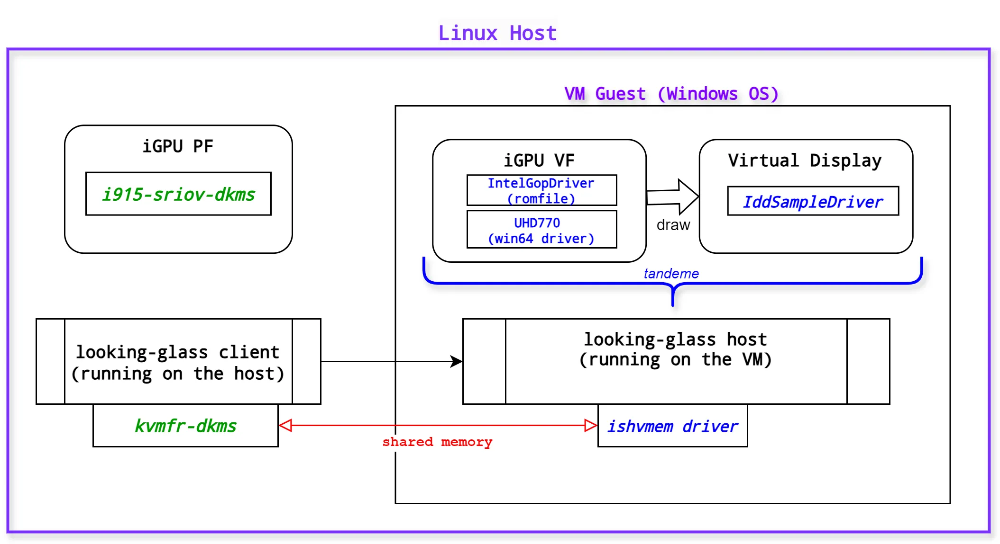
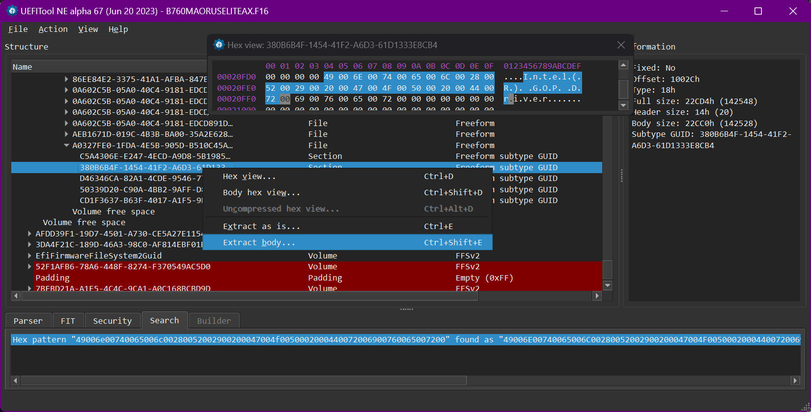
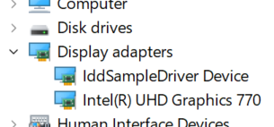

# iGPU passthrough via SR-IOV on Raptor Lake i5-13600K to Win10/11 VMs with Looking Glass



## What do you need to get it work

==**Notice: this package is **highly experimental**, you should only use it when you know what you are doing.**==

Tested Linux Kernel versions:
- **6.1.60-lts** - works perfectly, I've been using this branch for almost the entire year of 2024 for a fast and responsive desktop on VMs without any lag.
- **6.11.2-zen** - everything works. Source code had been synchronized with @strongtz but I had got some i915 errors during boot and init in dmesg. Then I had integrated @bbaa-bbaa Pull Request #207 and it solved the issue and now everything works without errors.

## 1. Linux host setup

1) UEFI BIOS settings. I think the only settings that matter are:
```
VT-D = Enabled
VMx - Enabled
SR-IOV = Enabled
```

But just in case, here's a more complete list:
```
IOMMU = doesn't matter (on my ASUS motherboard)
Above 4G Decoding = Enabled
ReSizeBar = Enabled
iGPU multimon = Disabled
iGPU memory = 256Mb
PCIe Express Native Control = Enabled
PCIe ASPM = Enabled
PCH/DMI ASPM = Enabled
```

2) Ensure the following kernel config parameters are set:
```
CONFIG_INTEL_MEI_PXP=m
CONFIG_DRM_I915_PXP=y
CONFIG_SYSFS=y
```

3) Ensure that `linux-firmware` package installed.

4) Build and install the following dkms module for your kernel:
	* **i915.ko** (this repository):
		```
		cd /usr/src
		git clone https://github.com/resiliencer/i915-sriov-dkms
		cd i915-sriov-dkms
		dkms add .
		dkms autoinstall
		```		
		
5) And one more dkms module, from [Looking Glass](https://looking-glass.io/) solution: 
	* **kvmfr.ko** (looking glass, version B6 or mb later)  
	The build process is similar. Look at: [AUR](https://aur.archlinux.org/looking-glass.git) or use official build manual.

6) Kernel cmdline += ` clocksource=tsc nohpet intel_iommu=on iommu=pt kvm.ignore_msrs=1 kvm.report_ignored_msrs=0 split_lock_detect=off initcall_blacklist=sysfb_init vfio-pci.enable_sriov=1 i915.modeset=1 i915.enable_guc=3 i915.max_vfs=7 i915.reset=1 transparent_hugepage=never `  
    
	Not all parameters may be required. 
	Edit kernel cmdline and update grub:  
`nano /etc/default/grub && grub-update` 

7) Reboot.  

Check that everything works:
```
# dmesg | grep i915
...
[...] i915: loading out-of-tree module taints kernel.
[...] i915: module verification failed: signature and/or required key missing - tainting kernel
[...] i915 0000:00:02.0: Running in SR-IOV PF mode
[...] i915 0000:00:02.0: [drm] VT-d active for gfx access
[...] i915 0000:00:02.0: vgaarb: deactivate vga console
[...] i915 0000:00:02.0: [drm] Using Transparent Hugepages
[...] i915 0000:00:02.0: vgaarb: VGA decodes changed: olddecodes=io+mem,decodes=io+mem:owns=io+mem
[...] i915 0000:00:02.0: [drm] Finished loading DMC firmware i915/adls_dmc_ver2_01.bin (v2.1)
[...] i915 0000:00:02.0: [drm] GT0: GuC firmware i915/tgl_guc_70.bin version 70.29.2
[...] i915 0000:00:02.0: [drm] GT0: HuC firmware i915/tgl_huc.bin version 7.9.3
[...] i915 0000:00:02.0: [drm] GT0: HuC: authenticated for all workloads
[...] i915 0000:00:02.0: [drm] GT0: GUC: submission enabled
[...] i915 0000:00:02.0: [drm] GT0: GUC: SLPC enabled
[...] i915 0000:00:02.0: [drm] GT0: GUC: RC enabled
[...] i915 0000:00:02.0: [drm] Protected Xe Path (PXP) protected content support initialized
[...] [drm] Initialized i915 1.6.0 for 0000:00:02.0 on minor 0
[...] i915 0000:00:02.0: 7 VFs could be associated with this PF
...
```
You can also see the firmware versions.  
And turn on SR-IOV:
```
# echo 2 > /sys/devices/pci0000:00/0000:00:02.0/sriov_numvfs
# lspci -s 02
00:02.0 VGA compatible controller: Intel Corporation Raptor Lake-S GT1 [UHD Graphics 770] (rev 04)
00:02.1 VGA compatible controller: Intel Corporation Raptor Lake-S GT1 [UHD Graphics 770] (rev 04)
00:02.2 VGA compatible controller: Intel Corporation Raptor Lake-S GT1 [UHD Graphics 770] (rev 04)
```

Or use **sysfsutils** and add `devices/pci0000:00/0000:00:02.0/sriov_numvfs = 2` into your `/etc/sysfs.conf`.

---
## 2. libvirt/qemu config preparation for VM (win10/win11)
    
#### First of all, you need to extract `IntelGopDriver.efi` from your BIOS:

Download your current UEFI BIOS version from the manufacturer's website for your motherboard and unzip it.  
Find a file like `xxx.cap` or similar, which is usually fed to BIOS flash update, like that:

|Manufacturer|Filename example|
|:-------------------|:----------|
|ASUS| SZ790AD4.CAP|
|MSI| E7B86AMS.1J5|
|GIGABYTE| B760MAORUSELITEAX.F16|

Open it in [UEFITool](https://github.com/LongSoft/UEFITool) and search for hex:  
&emsp; `4900 6e00 7400 6500 6c00 2800 5200 2900 2000 4700 4f00 5000 2000 4400 7200 6900 7600 6500 7200`  
Right-click on the result, choose "Extract body..." and save it.  



#### Pass saved file to the `romfile` parameter of your VM config:  
* for qemu: `-device vfio-pci,host=0000:00:02.1,romfile=/whereveris/yours/IntelGopDriver.efi`  
* for libvirt: `<rom file='/whereveris/yours/IntelGopDriver.efi'/>`  
otherwise iGPU will not be able to initialize properly and you will get error n.43.  

#### Detaching VFs from host to make them usable for VMs:
```
virsh nodedev-detach pci_0000_00_02_1
virsh nodedev-detach pci_0000_00_02_2
```

#### Activating the kernel module (kvmfr) to be able to use low latency shared memory access (DMA):
```
modprobe -v kvmfr static_size_mb=128
chmod 0660 /dev/kvmfr0
chown $(whoami):libvirt-qemu /dev/kvmfr0
```

#### Configuration files for libvirt or qemu you can find [here](https://github.com/resiliencer/i915-sriov-dkms/tree/master/configs/02-libvirt-qemu).


## 3. Internal preparation of VM

1. Take a standart **Q35 OVMF** virtual machine with **QXL video adapter** and boot into Windows OS.
2. Setup remote desktop services in Windows OS and connect to it from your Linux host.
3. Install ==iddSampleDriver== (virtual display) in Windows OS.  
   Look [here](https://github.com/ge9/IddSampleDriver) and [here](https://github.com/roshkins/IddSampleDriver).  
   Configuration for it: [option.txt](configs/03-windows-vm/IddSampleDriver/option.txt) The location of this file must be "C:\IddSampleDriver\option.txt" (hard-coded)
4. Add iGPU VF ==with your romfile== to the VM and install iGPU driver in Windows OS.
5. Install ==looking-glass host application== (version B6 or newer) with ==ishvmem== driver on your windows VM: [looking-glass-host-setup.exe](https://looking-glass.io/artifact/stable/host)  
   Look at config here: [looking-glass-host.ini](configs/03-windows-vm/Looking%20Glass%20(host)/looking-glass-host.ini)
6. Ensure that ==kvmfr== kernel module (it shares memory with ==ivshmem== driver) is loaded on your Linux host:  
  `lsmod | grep kvmfr`  
  If not, load it: `modprobe -v kvmfr`
7. If everything is ok remove QXL video adapter from your VM. Also check that kvmfr memory size is correct for your IddSampleDriver resolution of virtual display. 
8. Finally migrate from remote desktop client to looking glass client (which you must build from source and run on your Linux Host).  
   Looking glass [client config](configs/01-linux-host/etc/looking-glass-client.ini).  
   Finally you will get something like that:

   


All configuration files you can find in [configs](configs/) , I hope this helps. Good luck.  


### Donuts / coffee:

XMR: `88LBEBEKbLqQ3GDBHsqLgidbYCLH6uFZZ4BsZr42URJgaJs5SozsejEYc2YRmvbGHC5FbkzcucTsNB4nAtyQVXbGSxzat5e`  
BTC: `bc1qqw2detp3rxxs5aqz66uxctzlf9ad5ge25jcfa5` or `1JySHpr7AVvQWrCjE1qADA8HGa1RbSCLmc` 


